# Success Planner MCP Software Design

## Purpose

This document defines the top-down software design for Success Planner MCP from application startup through each primary user workflow and application shutdown. It is written as a build guide: each component includes coding responsibilities and testing expectations.

Success Planner MCP is a solo, local-first personal success planner. The interface should remain simple enough to drive by mouse or touch, while the internal system manages tasks, focus sessions, movement, review, local storage, and Microsoft integrations.

## Design Goals

- Start quickly and show the Home screen without requiring sync to finish.
- Keep all daily actions point-and-click.
- Store local changes first, then sync in the background.
- Make every user action recoverable if sync fails.
- Keep Microsoft-specific details out of the main user interface.
- Make each completed milestone visible in the running app.
- Test each component in isolation before connecting it to the full app.
- Support future phone companion sync without redesigning the core model.

## Implementation Pattern

Development should follow visible vertical slices. A backend service may be built first, but it is only a sub-step. A workflow component is not complete until the user can see it, click it, and observe its current state in the app.

Each workflow should move through this order:

```text
1. Domain model
2. Service or repository
3. View model
4. View
5. Navigation from Home
6. User-visible status or diagnostics
7. Unit tests
8. Integration tests where relevant
9. Manual click-through acceptance
```

For infrastructure-only work, such as settings, database, sync queue, or adapters, the app must still provide visual insight before the milestone is considered complete. That may be a real workflow screen, a status panel, or a plain-language diagnostics screen.

Example:

```text
SettingsService coded
  -> not complete as a user milestone

SettingsService + SettingsViewModel + SettingsView + Home navigation + visible loaded settings
  -> complete Settings workflow milestone
```

This keeps the project honest: the code may be complex under the hood, but every finished step should make the app more understandable from the outside.

## Top-Level Runtime Flow

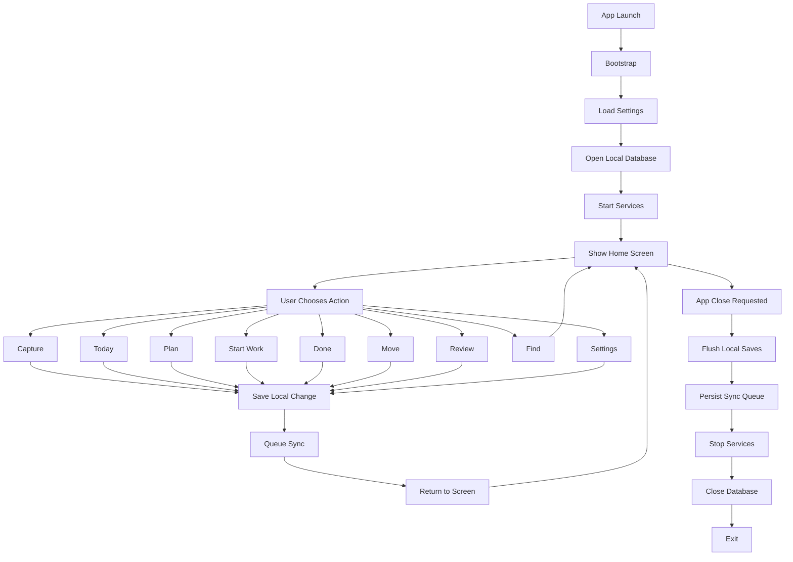

## Recommended Solution Structure

```text
SuccessPlannerMCP/
  src/
    SuccessPlanner.App/              WPF desktop app
    SuccessPlanner.Core/             domain objects and business rules
    SuccessPlanner.Application/      services and use cases
    SuccessPlanner.Infrastructure/   SQLite, settings, logging
    SuccessPlanner.Integrations/     Graph, Project COM, import/export
    SuccessPlanner.Phone/            future .NET MAUI companion

  tests/
    SuccessPlanner.Core.Tests/
    SuccessPlanner.Application.Tests/
    SuccessPlanner.Infrastructure.Tests/
    SuccessPlanner.Integrations.Tests/
    SuccessPlanner.App.Tests/

  docs/
    architecture/
    test-plans/
```

For the current repository, documents can remain at the root until the first code scaffold is created.

## Application Startup Design

### Startup Sequence

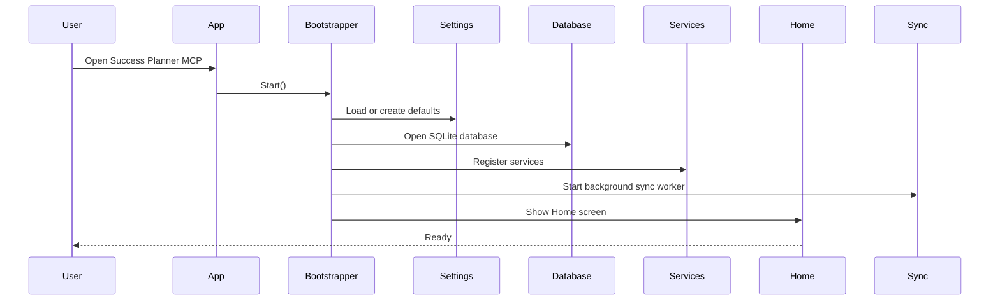

### Components To Code

```text
AppBootstrapper
  LoadSettings()
  OpenDatabase()
  RegisterServices()
  StartBackgroundWorkers()
  ShowHome()

SettingsService
  Load()
  Save()
  CreateDefaults()

DatabaseService
  Open()
  Migrate()
  HealthCheck()
  Close()

AppShellViewModel
  CurrentScreen
  NavigateHome()
  NavigateTo(screen)
  ShowStatus(message)
```

### Startup Tests

- App creates default settings when no settings file exists.
- App opens an existing settings file without changing unrelated values.
- Database migration runs only when needed.
- App still opens Home screen if Microsoft sync is unavailable.
- Home screen shows local ready status within a short startup window.
- Startup failure shows a simple recovery message and writes a detailed log.

## Home Screen Design

The Home screen is the main control panel.

### User Controls

- Capture
- Today
- Plan
- Start
- Done
- Move
- Review
- Find
- Settings

### Components To Code

```text
HomeView
HomeViewModel
HomeCommand
NavigationService
StatusBadgeViewModel
```

### Home Tests

- Each tile navigates to the correct screen.
- Tile labels remain simple and nontechnical.
- Status badge can show Ready, Working, Syncing, Offline, and Needs Attention.
- Keyboard focus does not break mouse-first behavior.
- Layout remains usable at expected desktop window sizes.

## Capture Workflow

Capture is for quick ideas, tasks, project steps, reminders, or movement plans.

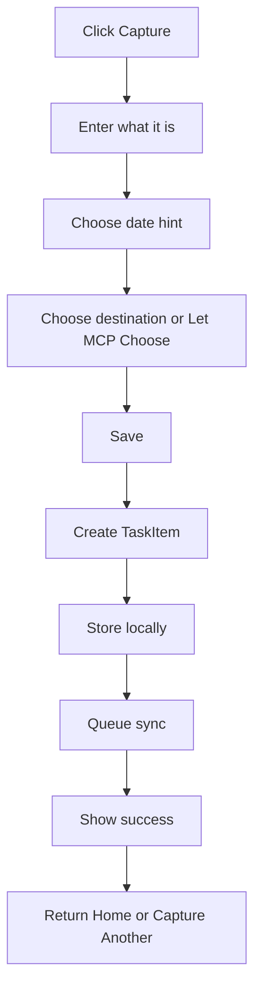

### Components To Code

```text
CaptureView
CaptureViewModel
TaskService.CaptureTask()
PlanningService.ChooseDestination()
TaskRepository.Add()
SyncService.QueueChange()
```

### Capture Tests

- Empty title cannot be saved.
- A captured task can be saved with no date.
- Date buttons create correct date hints.
- Let MCP Choose assigns a reasonable default destination.
- Save writes the task to SQLite before any sync attempt.
- Failed sync does not lose the captured task.
- Capture Another clears the form and keeps the user on Capture.

## Today Workflow

Today shows a small, manageable set of important actions.

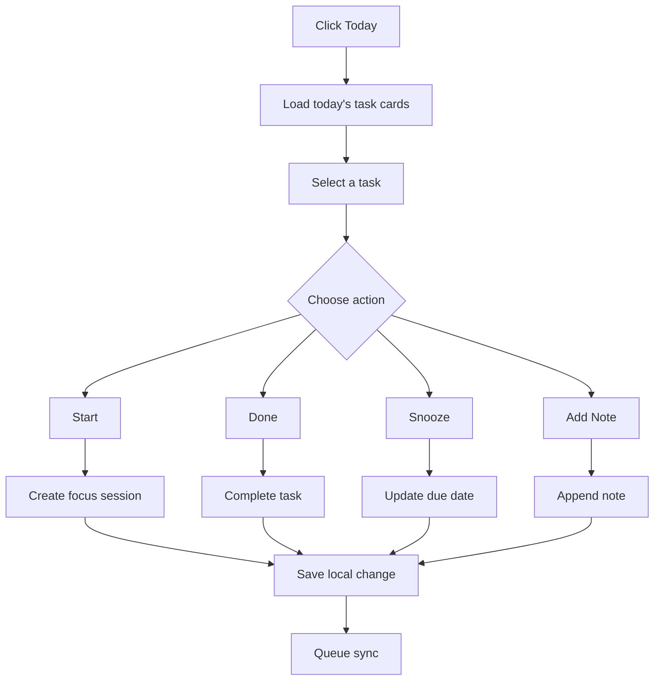

### Components To Code

```text
TodayView
TodayViewModel
TaskCardViewModel
TaskService.GetTodayTasks()
TaskService.CompleteTask()
TaskService.SnoozeTask()
TaskService.AddNote()
FocusService.StartSession()
```

### Today Tests

- Today loads only tasks that belong in the today view.
- Completed tasks disappear or move to Done feedback based on setting.
- Snooze moves the task to the selected date.
- Add Note preserves existing notes.
- Start creates a focus session with the selected task.
- The view stays useful with zero tasks, one task, and many tasks.

## Plan Workflow

Plan converts loose items into small, realistic next actions.

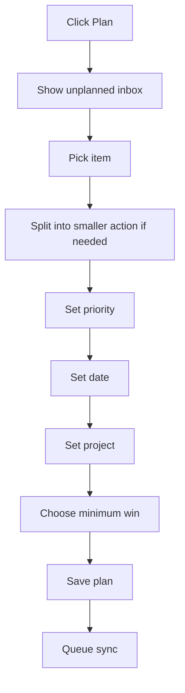

### Components To Code

```text
PlanView
PlanViewModel
InboxItemViewModel
PlanningService.AssignPriority()
PlanningService.AssignDate()
PlanningService.AssignProject()
TaskService.SplitIntoTinySteps()
PlanningService.ChooseRealisticGoal()
```

### Plan Tests

- Unplanned inbox shows tasks without enough planning data.
- Split Into Tiny Steps creates child tasks or a checklist without losing the original.
- Minimum Win can be smaller than the stretch goal.
- Project assignment updates both task and project views.
- Planning changes are saved locally and queued for sync.

## Start Work Workflow

Start Work removes decision fatigue and encourages short focus sessions.

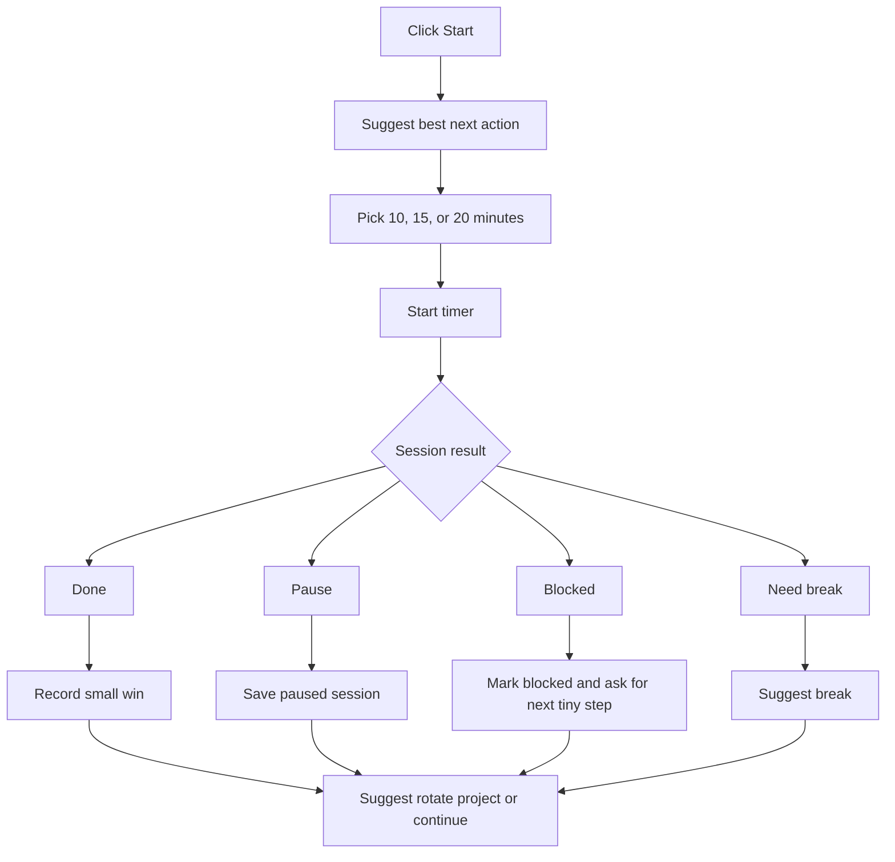

### Components To Code

```text
StartWorkView
StartWorkViewModel
FocusTimerViewModel
FocusService.SuggestNextSmallStep()
FocusService.StartSession()
FocusService.PauseSession()
FocusService.CompleteSession()
FocusService.SuggestBreak()
PlanningService.RotateProjectsAfterWin()
ReviewService.GetSmallWins()
```

### Start Work Tests

- Suggested next action is selected from available planned tasks.
- User can override the suggestion.
- Timer can start, pause, resume, and complete.
- 20 minutes is the default session length.
- Done records a small win.
- Blocked status does not mark the task complete.
- After completion, the app can suggest rotating to another project.

## Done Workflow

Done is a fast completion path.

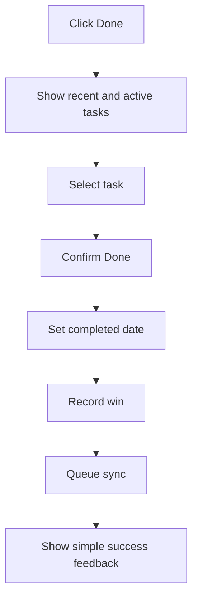

### Components To Code

```text
DoneView
DoneViewModel
TaskService.CompleteTask()
ReviewService.RecordWin()
SyncService.QueueChange()
```

### Done Tests

- Completing a task sets status and completed date.
- Completing a task twice is harmless.
- Completion is stored locally before sync.
- Completion feedback is brief and encouraging.
- The completed task appears in Review.

## Move Workflow

Move makes physical activity a first-class part of the success system.

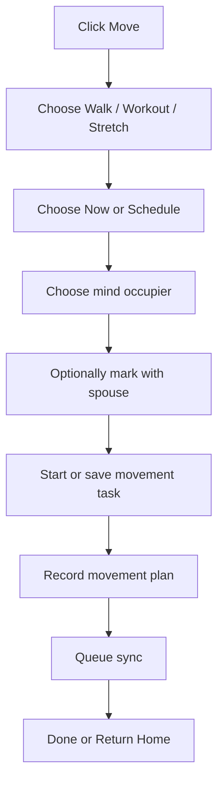

### Components To Code

```text
MoveView
MoveViewModel
MovementService.ScheduleWalk()
MovementService.ScheduleWorkout()
MovementService.SuggestMindOccupier()
MovementService.CompleteMovement()
TaskService.CaptureTask()
```

### Move Tests

- Walk, workout, and stretch create valid physical activity tasks.
- Schedule creates a future task with a date/time.
- Start Now creates an active movement session.
- Mind occupier selection is saved in notes or metadata.
- Movement completion appears in Review as a success win.

## Review Workflow

Review helps the user learn and adjust without turning the app into a performance judge.

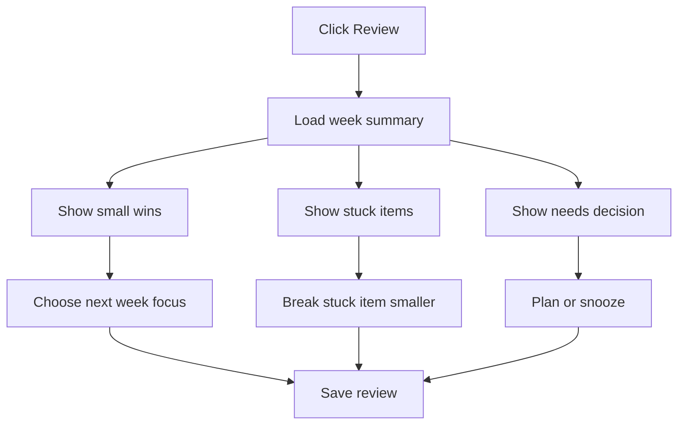

### Components To Code

```text
ReviewView
ReviewViewModel
ReviewService.GetWeeklySummary()
ReviewService.GetSmallWins()
ReviewService.GetStuckItems()
ReviewService.GetNeedsDecisionItems()
PlanningService.ChooseRealisticGoal()
TaskService.SplitIntoTinySteps()
```

### Review Tests

- Review includes completed tasks, focus sessions, and movement wins.
- Stuck items are tasks with blocked status or repeated snoozes.
- Needs Decision items are visible without overwhelming the screen.
- Save Review persists selected next focus.
- Review works with no data and with a full week of data.

## Find Workflow

Find searches the local database first.

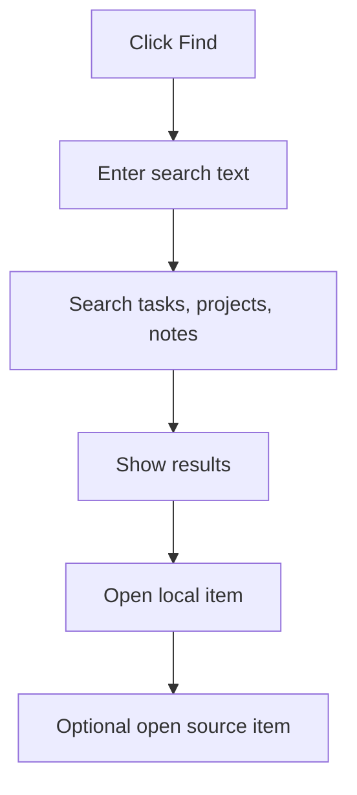

### Components To Code

```text
FindView
FindViewModel
SearchService.SearchTasks()
SearchService.SearchProjects()
SearchService.SearchNotes()
IExternalTaskAdapter.OpenSourceItem()
```

### Find Tests

- Search finds task titles.
- Search finds notes.
- Search handles no results.
- Search does not require Microsoft sync.
- Open Source Item calls the correct adapter when a source link exists.

## Settings Workflow

Settings is where technical details may exist, but still in plain language.

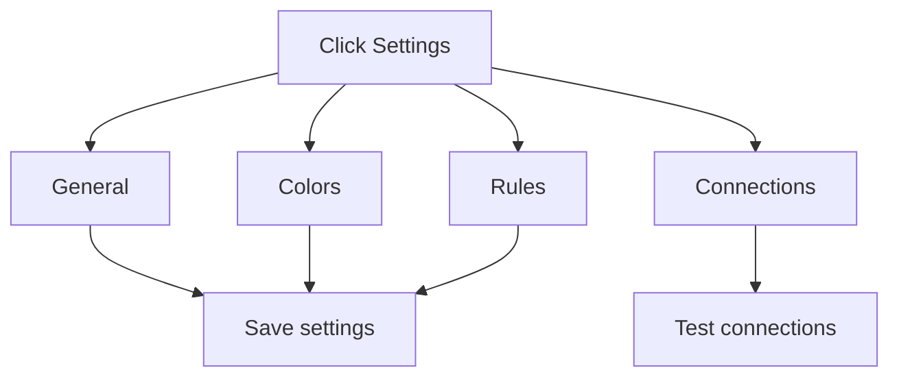

### Components To Code

```text
SettingsView
SettingsViewModel
SettingsService.Load()
SettingsService.Save()
ConnectionTestService.TestTodo()
ConnectionTestService.TestPlanner()
ConnectionTestService.TestProjectDesktop()
DestinationRuleService.SaveRules()
```

### Visible Settings Requirements

The Settings workflow must show the user what the app actually loaded.

The first Settings screen should display:

- Profile name
- Default focus minutes
- Sync on launch status
- Large controls setting
- Enabled connections: To Do, Planner, Project Desktop, Phone Companion
- Destination rules summary
- Settings file status: Loaded defaults, Loaded from file, Recovered from backup, or Recreated after invalid file

The first Settings screen does not need to expose every edit control. It does need to prove visually that the SettingsService is active and understandable.

### Settings Tests

- Settings load from disk.
- Settings save to disk.
- Invalid settings are rejected with a simple message.
- Connection tests do not block the main UI.
- Destination rules are validated before saving.

## Sync Design

All user-facing changes follow the same rule: save local first, then sync.

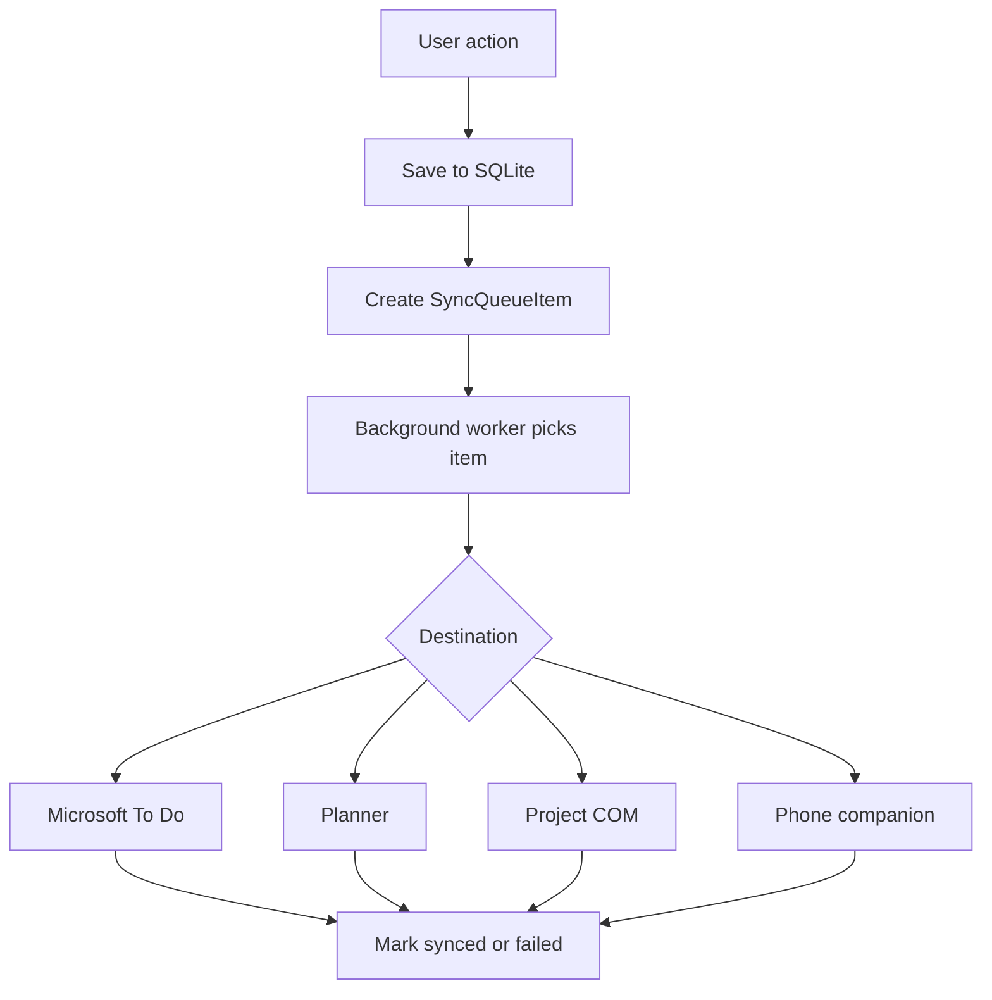

### Components To Code

```text
SyncService
SyncQueueRepository
SyncWorker
TodoGraphAdapter
PlannerGraphAdapter
ProjectComAdapter
PhoneCompanionAdapter
ConflictResolver
```

### Sync Tests

- Queue item is created for each sync-worthy change.
- Sync retry count increases after failure.
- Failed sync keeps local data intact.
- Successful sync updates SourceLink and LastSyncedAt.
- Adapter failures are logged without crashing the app.
- Conflict resolver preserves the newest safe local change by default.

## Local Database Design

Suggested initial tables:

```text
Tasks
Projects
Milestones
Notes
FocusSessions
SuccessGoals
MovementSessions
SourceLinks
SyncQueue
Settings
ReviewEntries
```

### Database Tests

- Database can be created from empty.
- Migrations are repeatable.
- Repositories can add, update, delete, and query records.
- Local data survives app restart.
- Database closes cleanly during shutdown.

## Application Shutdown Design

Shutdown should be calm and protective. The app should not lose work because a sync is slow.

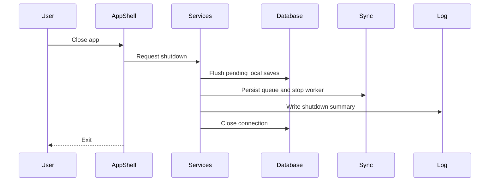

### Components To Code

```text
ShutdownService
  RequestShutdown()
  FlushLocalChanges()
  StopBackgroundWorkers()
  PersistSyncQueue()
  CloseDatabase()

AppShellViewModel
  CanClose()
  Close()
```

### Shutdown Tests

- App closes cleanly with no pending work.
- App closes cleanly with unsynced queue items.
- Pending local edits are flushed before exit.
- Background sync worker stops within timeout.
- Next launch resumes unsynced queue items.

## Testing Strategy

### Unit Tests

Test pure business rules:

- task status changes
- date hint conversion
- priority assignment
- tiny-step splitting
- focus session timing rules
- movement task creation
- review summary calculations

### Integration Tests

Test real infrastructure with controlled dependencies:

- SQLite repositories
- settings file read/write
- sync queue persistence
- adapter interface contracts
- Project desktop detection when available

### UI Tests

Test user paths:

- launch to Home
- Capture and save task
- Today Start and Done
- Plan an inbox item
- Start a 20-minute session
- Create a Move activity
- Review weekly progress
- close and reopen with data intact

### Manual Acceptance Tests

Before each milestone is considered done:

- A nontechnical user can complete the workflow by clicking only.
- The running app shows visible evidence of the new capability.
- No main screen exposes API, Graph, OAuth, COM, VBA, database, or adapter language.
- The app remains useful when offline.
- The app does not show more decisions than needed.
- The user can recover from a failed sync without losing the task.

## Build Order

```text
1. App bootstrap and Home screen shell
2. Navigation shell and screen host
3. Settings workflow visible slice
4. Core domain objects
5. SQLite database and repositories
6. Capture workflow
7. Today workflow
8. Done workflow
9. Start Work timer workflow
10. Move workflow
11. Plan workflow
12. Review workflow
13. Find workflow
14. Sync queue with visible status
15. Microsoft To Do adapter with visible connection status
16. Project desktop detection and import with visible detection status
17. Planner availability test with visible connection status
18. Phone companion quick capture
```

## Definition Of Done For Each Component

Each component is complete only when:

- Code is implemented.
- The feature is reachable from the running app when it is user-facing.
- The app shows visible status, state, or results for the feature.
- Unit tests pass.
- Relevant integration tests pass.
- User-facing text is simple and nontechnical.
- Failure state is handled.
- Local data is not lost if sync fails.
- The component is documented enough for future maintenance.
