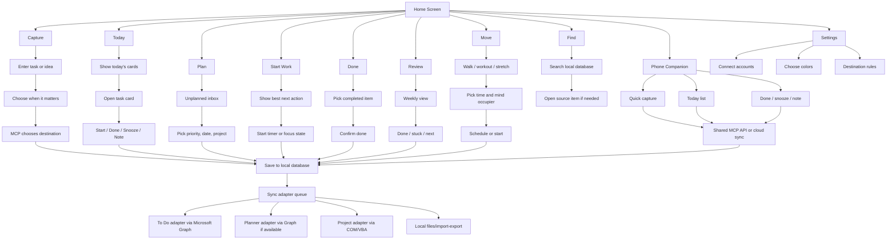
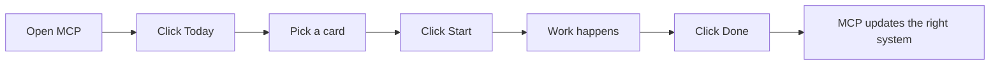

# Success Planner MCP Design

## Goal

Success Planner MCP is a solo, local Windows control program for personal project success. It hides Microsoft To Do, Planner, and Project complexity behind a simple mouse-driven interface with colorful, minimal screens.

The user should think in plain actions:

- Capture something
- See what matters today
- Plan the work
- Start the next thing
- Mark it done
- Review progress

The system handles where the item lives.

The desktop app is the primary control center. A phone app can be developed as a companion control surface that uses the same common task/project model and sync environment.

## Personal Success Principles

This app is not just a task manager. It is designed for a highly creative mind that can move very fast, jump directions quickly, and generate many possible projects at once.

The app should support these principles:

- Focus works best in short sessions, usually around 20 minutes.
- Timers should encourage healthy breaks instead of endless effort.
- Preparation matters: the app should help set up the next action before work begins.
- Tasks should be simplified into small, clear actions.
- Goals should be realistic and intentionally underset when needed so progress creates success momentum.
- Creative projects should be listed, visible, and prioritized by immediate need.
- Big activities should be broken into smaller accomplishments.
- After completing a goal in one project, the app can help shift time to another project instead of letting one project consume everything.
- Physical activity is part of the success system, not separate from it.
- Workouts and walks should be scheduled like meaningful project actions.
- Workout support should include ways to occupy the mind, such as music, podcasts, audio notes, learning, or walking with a spouse.

Design implication:

Success Planner MCP should help the user decide what to do next, start small, stop on purpose, celebrate completion, and rotate attention without losing the larger map.

## Top-Down Flowchart



## Primary Screens

### Home

Purpose: one-click entry into the system.

Controls:

- Big tile button: Capture
- Big tile button: Today
- Big tile button: Plan
- Big tile button: Start Work
- Big tile button: Done
- Big tile button: Review
- Big tile button: Move
- Small icon button: Find
- Small icon button: Settings

Color intent:

- Blue: Capture
- Green: Today
- Yellow: Plan
- Teal: Start Work
- Gray: Done
- Purple: Review
- Orange: Move / exercise
- Red: Needs attention

### Capture

Purpose: quickly add a thought, task, project step, reminder, or idea.

Controls:

- Large text box: "What is it?"
- Date choice buttons: Today, Tomorrow, This Week, Pick Date, No Date
- Destination buttons: Let MCP Choose, To Do, Planner, Project
- Save button
- Cancel button

### Today

Purpose: show only a manageable number of important items.

Controls:

- Task cards
- Start button
- Done button
- Snooze button
- Add Note button
- Filter chips: All, Work, Home, Errands, Waiting

### Plan

Purpose: sort loose items into useful structure.

Controls:

- Inbox card list
- Priority buttons: Low, Normal, High, Critical
- Date picker
- Project picker
- Destination picker
- Save button

### Start Work

Purpose: remove decision fatigue.

Controls:

- Best next action card
- Start button
- Skip button
- Blocked button
- Done button
- Timer toggle
- Session length buttons: 10, 15, 20 minutes
- Break reminder button

### Move

Purpose: make physical activity part of the plan.

Controls:

- Walk button
- Workout button
- Stretch button
- Bring spouse button
- Add audio button
- Schedule button
- Done button

The Move screen should feel encouraging, not clinical. It should help start the activity quickly and reduce reluctance by pairing exercise with something mentally engaging.

### Review

Purpose: simple weekly project health check.

Controls:

- Done this week
- Still open
- Stuck
- Needs date
- Create report button

## Phone Companion

Purpose: quick capture and lightweight task action away from the PC.

The phone app should not expose every desktop feature. It should be a simple remote control for the same MCP environment.

Primary phone controls:

- Capture
- Today
- Start
- Done
- Later
- Note
- Search

Recommended phone tabs:

- Today
- Capture
- Review
- Find

Phone design rules:

- Large touch targets
- Minimal typing
- Voice dictation friendly
- One action per screen
- Same color language as desktop
- Offline capture with later sync
- No exposed API, adapter, or file language

Phone first-screen concept:

```text
Today

[ Capture ]

Next:
[ Call insurance about claim       Start ]
[ Review project budget            Done  ]
[ Send follow-up email             Later ]
```

## Shared Environment Options

The desktop and phone need one common environment. There are three practical paths.

### Option A: Microsoft Cloud as the Shared Hub

The phone app writes to Microsoft To Do through Microsoft Graph. The desktop MCP reads from To Do and syncs into the local database.

Best for:

- Fastest useful phone version
- Capture, Today, Done, Later
- Keeping phone sync simple

Tradeoff:

- Phone cannot easily control local Project desktop files unless the desktop MCP is running and syncing them.

### Option B: Desktop MCP Local API

The Windows MCP runs a small local service. The phone app talks to it over the local network or through a secure tunnel.

Best for:

- True shared MCP database
- Full access to local Project automation
- One common source of truth

Tradeoff:

- More setup
- Requires network/security decisions
- Desktop PC may need to be on

### Option C: Private Cloud Database

Both desktop and phone sync through a small private cloud database or backend.

Best for:

- Most complete long-term architecture
- Works when away from home
- Cleaner multi-device sync

Tradeoff:

- More complex than a solo local app
- Requires hosting, authentication, and backup planning

Recommended path:

Start with Option A for the first phone companion. Use Microsoft To Do as the shared capture/today lane. Keep the desktop MCP as the master planner that later pulls phone changes into the local database and routes items to Planner or Project.

## Top-Down System Design

```text
Success Planner MCP
  UI Layer
    Home Screen
    Capture Screen
    Today Screen
    Plan Screen
    Start Work Screen
    Move Screen
    Review Screen
    Settings Screen

  Application Layer
    Command Router
    Task Service
    Project Service
    Planning Service
    Review Service
    Search Service
    Sync Service
    Focus Service
    Movement Service

  Domain Layer
    Task
    Project
    Milestone
    Note
    FocusSession
    SuccessGoal
    SourceLink
    SyncState
    DestinationRule

  Adapter Layer
    Microsoft To Do Adapter
    Microsoft Planner Adapter
    Microsoft Project Adapter
    Phone Sync Adapter
    File Import/Export Adapter

  Infrastructure Layer
    SQLite Repository
    Settings Store
    Logging
    Authentication Token Store
    Sync Queue
    Optional Local MCP API
```

## Object-Oriented Design

### Core Domain Objects

```text
TaskItem
  Id
  Title
  Notes
  Status
  Priority
  DueDate
  StartDate
  CompletedDate
  ProjectId
  SourceLinks
  Tags
  EstimatedMinutes
  EnergyLevel
  IsTinyStep
  IsPhysicalActivity

ProjectItem
  Id
  Name
  Status
  StartDate
  DueDate
  SourceLinks
  Milestones

MilestoneItem
  Id
  ProjectId
  Name
  DueDate
  Status

SourceLink
  SourceSystem
  SourceId
  SourceUrl
  LastSyncedAt
  SyncDirection

DestinationRule
  Name
  Condition
  DestinationSystem
  DestinationListOrPlan

FocusSession
  Id
  TaskId
  PlannedMinutes
  StartedAt
  EndedAt
  Completed
  BreakTaken

SuccessGoal
  Id
  Name
  ProjectId
  TargetDate
  MinimumWin
  StretchWin
  Status
```

### Service Classes

```text
TaskService
  CaptureTask()
  UpdateTask()
  CompleteTask()
  SnoozeTask()
  AddNote()
  SplitIntoTinySteps()

PlanningService
  AssignPriority()
  AssignDate()
  AssignProject()
  ChooseDestination()
  ChooseRealisticGoal()
  RotateProjectsAfterWin()

ReviewService
  GetWeeklySummary()
  GetStuckItems()
  GetNeedsDecisionItems()
  GetSmallWins()

SyncService
  QueueChange()
  SyncNow()
  PullChanges()
  PushChanges()
  ResolveConflict()

SearchService
  SearchTasks()
  SearchProjects()
  SearchNotes()

FocusService
  StartSession()
  PauseSession()
  CompleteSession()
  SuggestBreak()
  SuggestNextSmallStep()

MovementService
  ScheduleWalk()
  ScheduleWorkout()
  SuggestMindOccupier()
  CompleteMovement()
```

### Adapter Interface

All external systems should follow one shared interface.

```text
IExternalTaskAdapter
  Name
  IsAvailable()
  PullTasks()
  PushTask()
  UpdateTask()
  CompleteTask()
  OpenSourceItem()
```

Implementations:

```text
TodoGraphAdapter
PlannerGraphAdapter
ProjectComAdapter
PhoneCompanionAdapter
FileExportAdapter
```

### Phone App Objects

```text
PhoneCommand
  Id
  CommandType
  TaskId
  Text
  CreatedAt
  SyncStatus

PhoneCapture
  Id
  Title
  Notes
  DueHint
  CreatedAt
  SourceDevice

DeviceRegistration
  Id
  DeviceName
  DeviceType
  LastSeenAt
  IsTrusted
```

## Suggested Technology

Primary build:

- C# / .NET
- WPF for the first desktop version
- SQLite for local storage
- Microsoft Graph SDK for To Do and Planner where available
- COM automation for Microsoft Project desktop
- PowerShell/VBA helper scripts only where they simplify Project automation

Phone companion options:

- .NET MAUI if one C# codebase is preferred
- React Native if mobile UI speed and ecosystem matter more
- Progressive Web App if installation simplicity matters most

For this project, .NET MAUI is the natural companion choice because it keeps C#/.NET shared between desktop and phone.

## Control Philosophy

The interface should avoid technical labels.

Use:

- Add
- Today
- Plan
- Start
- Done
- Later
- Move
- Find
- Review

Avoid:

- Graph
- API
- Sync state
- Adapter
- Bucket ID
- Tenant
- OAuth

Those belong in diagnostics and settings, not the everyday screen.

## First Build Milestone

Version 0.1 should prove the local control experience before deep integration.

Build:

- Home screen
- Capture screen
- Today screen
- Start Work screen with 20-minute timer
- Move screen
- Local SQLite storage
- Manual task creation
- Done and snooze actions
- Simple weekly review

Then add:

- Microsoft To Do sync
- Project desktop detection
- Project task import
- Planner availability test
- Phone companion quick capture
- Phone Today list

## Simplest Daily Workflow


